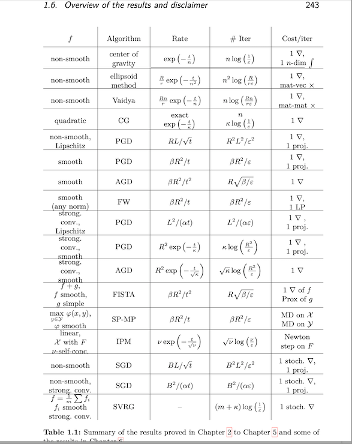

Alogrithms for Convex functions.

Notes from C395_Lecture_Online_learning_Optimization

Other Reference material:

Convex Optimization – Boyd and Vandenberghe 

https://web.stanford.edu/class/ee364a/

Theory of Convex Optimization for Machine Learning - sebastian bubeck

http://sbubeck.com/BubeckLectureNotes.pdf

 
 
 
 

(Below reference taken from s bubeck's book)

