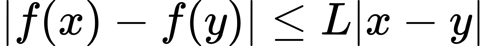
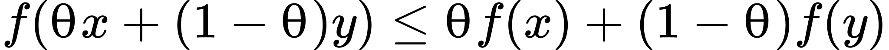

# Basic Gradient Descent 

**Key features:**
1. Improves at every iteration
2. Can take large step size - self tuning property (Smoothness property of cvx)
3. It can take bigger step size when far away from x* (Stongness property of cvx)

**Gradient descent update step - f convex and L-Liptschitz β smooth α strongly convex**

<!-- $$
xk+1 = xk − γ∇f(xk)
$$ --> 

where step size decay and self tuning property allows alg to reach x*

Example - convex quadratic function which is both smooth and strongly convex
<!-- $$
f_i(x) = \frac{1}{2} x^{\top}Q_ix + q_i^{\top} x + c_i,
$$ --> 

 
 

**step size - β smooth α Strongly convex**
<!-- $$
γ = 2/β+α \\β=2\lambda_{max}(Q) \\α =2\lambda_{min}(Q)
$$ --> 

Convergence rate - $O(exp(-T))$

**Useful Lemmmas**

Function Lipschitz continuity -  Let L ≥ 0. A real-valued function f is L-Lipschitz continuous iff ∀x, y ∈ dom f,
<!-- $$
|f(x) − f(y)| ≤ L|x − y|
$$ --> 

Function Lipschitz continuity -first order - A differentiable function f is L-Lipschitz continuous iff the norm of its gradient is bounded by L:

<!-- $$
∀x ∈ dom(f), |∇f(x)| ≤ L
$$ --> 

Gradient descent  - $β$ smoothness condition
<!-- $$
|∇f(x) − ∇f(y)| ≤ β|x − y|
$$ --> 

<!-- $$
∇^2f(x) \preceq βI 
$$ --> 

Gradient descent -$α$ Strongly convexity condition
<!-- $$
f(x) - α/2|x|^2
$$ --> 

<!-- $$
∇^2f(x) \succeq αI ⇐⇒ ∇^2f(x) − αI
$$ --> 

Gradient descent - $β$ smoothness in terms of Quadratic approximation upper bound  (Self tuning property)
<!-- $$
|f(x) − f(y) − ∇f(y)| (x − y)| ≤ β/2|x − y|^2
$$ --> 

Gradient descent -$α$ Strongly convexity in terms of Quadratic approximation (Ability to take big step size)
<!-- $$
f(x) ≥ f(y) − ∇f(y)^T(y − x) + α/2|x − y|^2
$$ --> 

Gradient descent -$α$ Strongly convexity $β$ smoothness 
<!-- $$
f(xk+1) − f(x^∗) ≤β/2exp (−4k /κ + 1)|x^t − x^∗|^2
$$ --> 

<!-- $$
κ = β/α
$$ --> 

**Recap- proving convexity/Optimality**
1. Validate Zero order condition :
<!-- $$
f(θx + (1 − θ)y) ≤ θf(x) + (1 − θ)f(y)
$$ --> 

2. Validate First order condition:
<!-- $$
f(y) ≥ f(x) + ∇f(x)^T(y − x)
$$ --> 

3. Validate Restriction of convex function f in dom(f) to a line
<!-- $$
g_{x,v}(t) := f(x + tv)
$$ --> 

4. Validate Second order condition
<!-- $$
∇^2f(x) > 0 (positive semidef)
$$ --> 

5. Optimality of x
<!-- $$
∇f(x)^T(y − x) ≥ 0
$$ --> 

